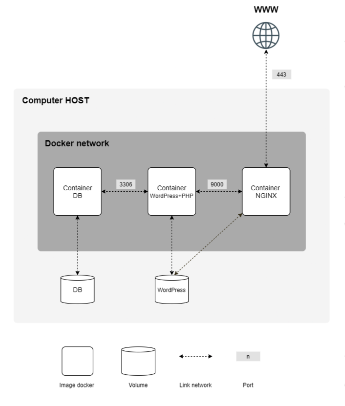

# Inception 

> This project aims to broaden your knowledge of system administration by using Docker.
You will virtualize several Docker images, creating them in your new personal virtual
machine.

## Content



- This project need to be done on a Virtual Machine.

- A Docker container that contains NGINX with TLSv1.2 or TLSv1.3 only. 

- A Docker container that contains WordPress + php-fpm (it must be installed and
configured) only without nginx.

- A Docker container that contains MariaDB only without nginx.

- A volume that contains your WordPress database.

- A second volume that contains your WordPress website files.

- A docker-network that establishes the connection between your containers.
Your containers have to restart in case of a crash.

```markdown
A Docker container is not a virtual machine. Thus, it is not recommended to use any hacky patch based on ’tail -f’ and so forth
when trying to run it.
Read about how daemons work and whether it’s a good idea to use them or not.
```

```markdown
Of course, using network: host or --link or links: is forbidden.
The network line must be present in your docker-compose.yml file.
Your containers musn’t be started with a command running an infinite loop.
Thus, this also applies to any command used as entrypoint, or used in entrypoint scripts. The following are a few prohibited hacky patches
: tail -f, bash, sleep infinity, while true.
```

```markdown
Read about PID 1 and the best practices for writing Dockerfiles.
```

- In your WordPress database, there must be two users, one of them being the administrator. The administrator’s username can’t contain admin/Admin or administrator/Administrator (e.g., admin, administrator, Administrator, admin-123, and
so forth).

```markdown
Your volumes will be available in the /home/login/data folder of the host machine using Docker.
Of course, you have to replace the login with yours.
```

- To make things simpler, you have to configure your domain name so it points to your
local IP address.
  - This domain name must be login.42.fr.
  - Again, you have to use your own login.
  - For example, if your login is wil, wil.42.fr will redirect to the IP address pointing to
  wil’s website.

```markdown
The latest tag is prohibited.
No password must be present in your Dockerfiles.
It is mandatory to use environment variables.
Also, it is strongly recommended to use a .env file to store
environment variables. The .env file should be located at the root of the srcs directory.
Your NGINX container must be the only entrypoint into your infrastructure via the port 443 only, using the TLSv1.2 or TLSv1.3 protocol.
```

## Project Diary

https://yeslee5004.notion.site/Inception-af2774492b7b42228bbaa2de321fa936
