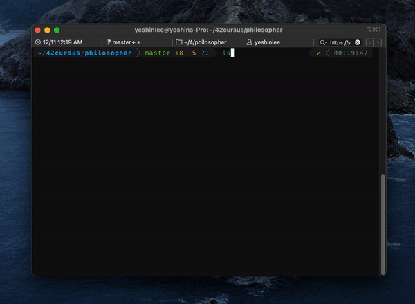

# philosopher

> In this project, you will learn the basics of threading a process. You will
learn how to make threads. You will discover the mutex.

## Content

- The program should take the following arguments:

  - `number_of_philosophers`: is the number of philosophers and also the number
  of forks.
  - `time_to_die`: is in milliseconds, if a philosopher doesn’t start eating ’time_to_die’
  milliseconds after starting their last meal or the beginning of the simulation,
  it dies.
  - `time_to_eat`: is in milliseconds and is the time it takes for a philosopher to
  eat. During that time they will need to keep the two forks.
  - `time_to_sleep`: is in milliseconds and is the time the philosopher will spend
  sleeping.
  - `number_of_times_each_philosopher_must_eat`: argument is optional, if all philosophers eat at least `number_of_times_each_philosopher_must_eat` the
simulation will stop. If not specified, the simulation will stop only at the death
of a philosopher.
  
- Each philosopher should be given a number from 1 to `number_of_philosophers`.
- Philosopher number 1 is next to philosopher number `number_of_philosophers`. Any other philosopher with the number N is seated between philosopher N - 1 and
philosopher N + 1.

- Any change of status of a philosopher must be written as follows (with X replaced
with the philosopher number and timestamp_in_ms the current timestamp in milliseconds):

  - `timestamp_in_ms X` has taken a fork
  - `timestamp_in_ms X` is eating
  - `timestamp_in_ms X` is sleeping
  - `timestamp_in_ms X` is thinking
  - `timestamp_in_ms X` died

- The status printed should not be scrambled or intertwined with another philosopher’s status.
- You can’t have more than 10 ms between the death of a philosopher and when it
will print its death.
- Again, philosophers **should avoid dying**!

### Mandatory part

- Each philosopher should be a thread.
- One fork between each philosopher, therefore if they are multiple philosophers, there
will be a fork at the right and the left of each philosopher.
- To avoid philosophers duplicating forks, you should protect the forks state with a
mutex for each of them.

### Bonus part (NOT YET!)

- All the forks are in the middle of the table.
- They have no states in memory but the number of available forks is represented by a semaphore.
- Each philosopher should be a process and the main process should not be a philosopher.

## Project Diary

https://yeslee5004.notion.site/Philosopher-b484eb81e6ec498991edd6886a0f96a1
