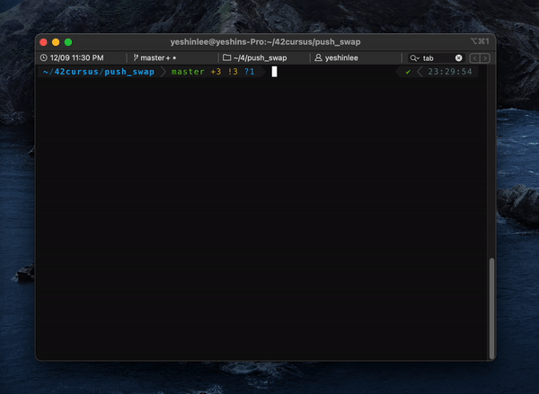

# push_swap

> This project will make you sort data on a stack, with a limited set of instructions, using
the lowest possible number of actions. To succeed you’ll have to manipulate various
types of algorithms and choose the one (of many) most appropriate solution for an
optimized data sorting.

## Contents

### 🏗 push_swap

- The game is composed of 2 stacks named a and b.
- To start with:
  - the stack a contains a random amount of negative and/or positive numbers
which cannot be duplicated. 
  - b is empty
- The goal is to sort in ascending order numbers into stack a.

### ✅ checker

- Write a program named checker, which will get as an argument the stack a formatted as a list of integers.
- The first argument should be at the top of the stack
(be careful about the order).
- If no argument is given checker stops and displays
nothing.

## Rules

- `sa` : swap a - swap the first 2 elements at the top of stack a. Do nothing if there
is only one or no elements).

- `sb` : swap b - swap the first 2 elements at the top of stack b. Do nothing if there
is only one or no elements).

- `ss` : sa and sb at the same time.

- `pa` : push a - take the first element at the top of b and put it at the top of a. Do
nothing if b is empty.

- `pb` : push b - take the first element at the top of a and put it at the top of b. Do
nothing if a is empty.

- `ra` : rotate a - shift up all elements of stack a by 1. The first element becomes
the last one.

- `rb` : rotate b - shift up all elements of stack b by 1. The first element becomes
the last one.

- `rr` : ra and rb at the same time.

- `rra` : reverse rotate a - shift down all elements of stack a by 1. The last element
becomes the first one.

- `rrb` : reverse rotate b - shift down all elements of stack b by 1. The last element
becomes the first one.

- `rrr` : rra and rrb at the same time.
